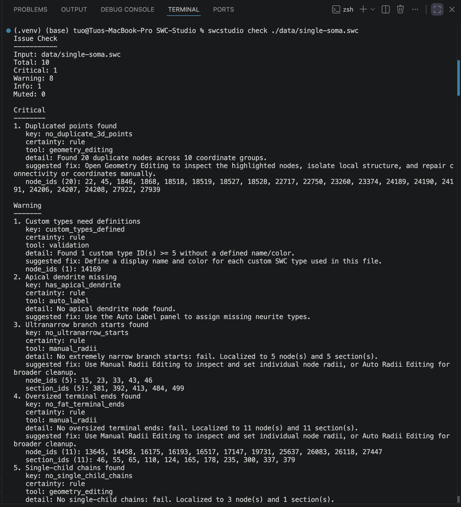
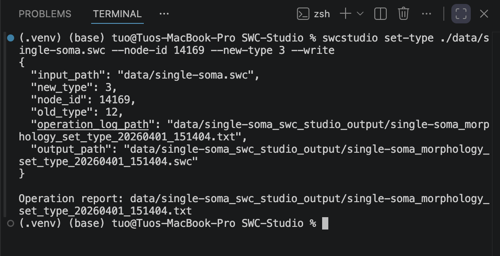
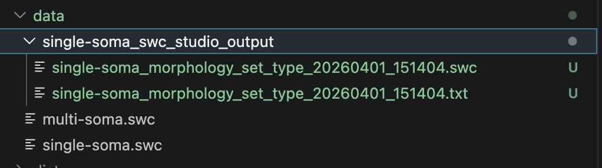
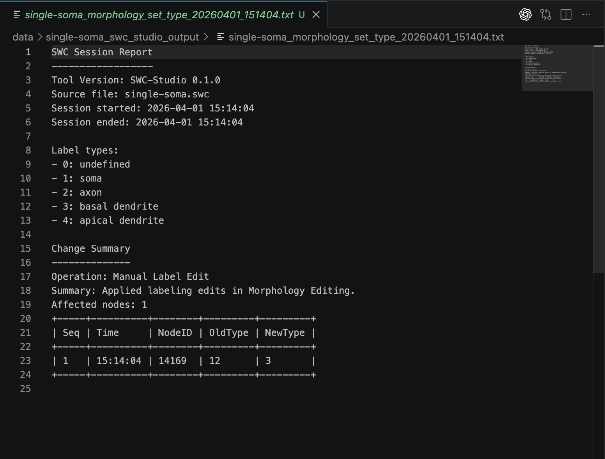

# CLI Tutorial

This tutorial introduces the core command-line workflow for inspecting one SWC file, running validation, applying common cleanup commands, and scaling the same work to folders.

## Before You Start

```{note}
You will need a working CLI install and one or more SWC files. If the command is not available on your path, use module mode from [Getting Started](../GETTING_STARTED.md).
```

The examples below use macOS/Linux path style. On Windows, replace `./data/...` with `.\data\...`.

## Step 1: Verify the CLI

Confirm that the CLI is installed and available:

```bash
swcstudio --help
```

If needed, use module mode:

```bash
python -m swcstudio.cli.cli --help
```

## Step 2: Inspect One File with `check`

Start with the broad issue summary:

```bash
swcstudio check ./data/single-soma.swc
```

This command prints the same combined issue list the GUI uses when a file is opened. It is a good first pass when you want a fast overview before running targeted commands.



*Step 2-1: Run `swcstudio check ./data/single-soma.swc` to inspect the GUI-style issue summary from the terminal.*

## Step 3: Run Structured Validation

Run the full validation workflow on a single file:

```bash
swcstudio validate ./data/single-soma.swc
```

Use this when you want a more explicit report of rule failures, warnings, and grouped results.

If you only want the rule guide:

```bash
swcstudio rule-guide
```

## Step 4: Apply a Targeted Cleanup Command

Choose the command that matches the issue you are trying to fix.

Examples:

Reindex one file:

```bash
swcstudio index-clean ./data/single-soma.swc --write
```

Run automatic fix and write the result:

```bash
swcstudio auto-fix ./data/single-soma.swc --write
```

Clean suspicious radii:

```bash
swcstudio radii-clean ./data/single-soma.swc
```

Use manual geometry or morphology edits when you need a more specific operation:

```bash
swcstudio set-type ./data/single-soma.swc --node-id 14169 --new-type 3 --write
swcstudio set-radius ./data/single-soma.swc --node-id 42 --radius 0.75 --write
swcstudio auto-label ./data/single-soma.swc --write
swcstudio connect ./data/single-soma.swc --start-id 10 --end-id 22 --write
```



*Step 4-1: Run `swcstudio set-type ./data/single-soma.swc --node-id 14169 --new-type 3 --write` to change one node label and write the updated SWC plus its log.*

## Step 5: Run a Batch Workflow

When the same operation needs to be repeated across a folder, use the batch commands.

Examples:

Validate every SWC in a folder:

```bash
swcstudio validate ./data
```

Split all multi-tree files:

```bash
swcstudio split ./data
```

Run folder-wide auto typing:

```bash
swcstudio auto-typing ./data --soma --axon --basal
```

Clean radii for a folder:

```bash
swcstudio radii-clean ./data
```

Simplify all files:

```bash
swcstudio simplify ./data
```

```{note}
Most feature commands accept `--config-json` so you can override parameters for one run without editing the default config files.
```

## Step 6: Review Generated Outputs

Many CLI workflows write reports or processed files into predictable output locations.

Typical outputs include:

- validation reports
- per-operation reports for file-editing commands
- split folders and split reports
- auto-typing output folders
- cleaned or edited SWC files inside the output folder



*Step 6-1: Open the output folder to review the generated SWC result and related report files.*



*Step 6-2: Open the operation log file for the previous command to review the recorded change summary and node table.*

## What You Learned

By the end of this tutorial, you should be able to:

- verify that the CLI is installed
- inspect one file with `check`
- run structured validation
- choose and apply targeted cleanup commands
- scale the same work to batch operations
- locate the resulting reports and outputs

## Related Pages

- [CLI Reference](../CLI_REFERENCE.md)
- [Tool Tutorials](../TOOL_TUTORIALS.md)
- [Logs And Reports](../LOGS_AND_REPORTS.md)
