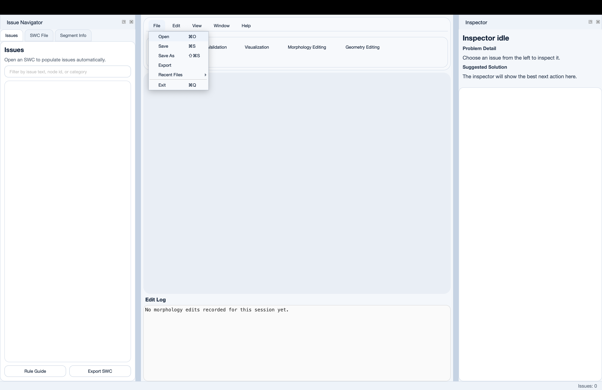
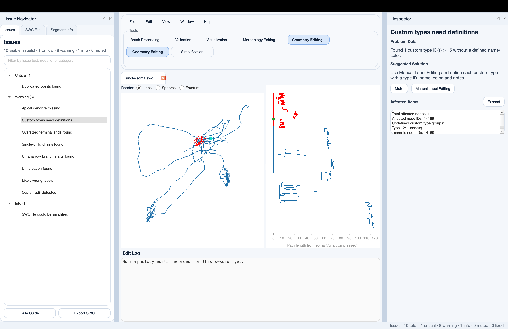
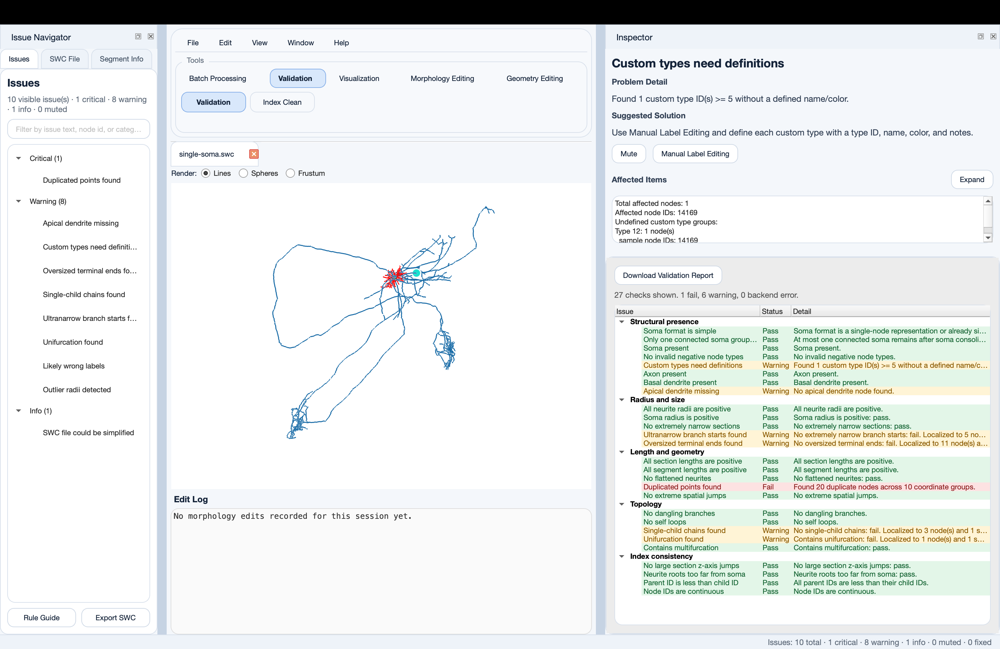
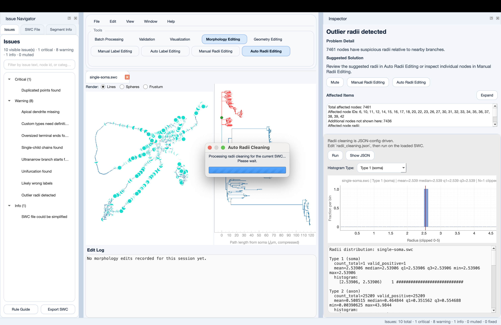
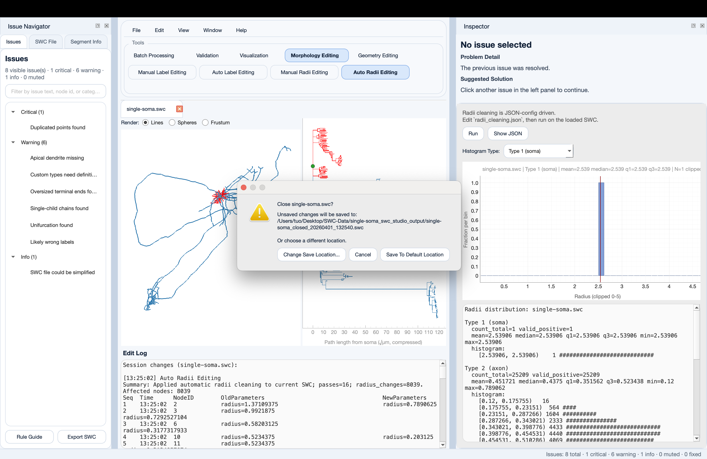

# GUI Tutorial

This tutorial walks through the main desktop workflow for reviewing one SWC file, identifying issues, applying repairs, and saving the updated result.

## Before You Start

```{note}
You will need a working GUI install and at least one SWC file to open. If the GUI is not installed yet, follow [Getting Started](../GETTING_STARTED.md).
```

You can start the application with:

```bash
swcstudio-gui
```

Module-mode fallback:

```bash
python -m swcstudio.gui.main
```

## Step 1: Open the GUI and Load an SWC File

Launch the application and open a morphology file from the File menu.

At this point, the central canvas should show the loaded reconstruction, while the side panels expose issue, file, and inspector information for the active document.



*Step 1-1: Open the `File` menu and choose the option to load an SWC file.*



*Step 1-2: The SWC file is loaded into the canvas and the side panels are populated for the active document.*

## Step 2: Run Validation

Switch to the `Validation` tool and run validation on the currently loaded file.

Validation is the recommended first action because it gives you a structured list of issues before you make edits.

Look for:

- structural problems in the tree
- index and parent-child ordering issues
- suspicious radii values
- labeling inconsistencies

```{note}
The GUI is designed around an issue-driven repair loop. Run validation first, then let the issue list guide the next tool you use.
```



*Step 2-1: Review the validation report and issue list before starting repairs.*

## Step 3: Review the Issue Navigator

Use the left-side issue list to inspect the current file one issue at a time.

When you select an issue, the application should:

- focus the relevant nodes in the canvas
- open the issue details in the Inspector panel
- switch to the tool that best matches the repair automatically

Typical follow-up tools include:

- `Index Clean` for ordering and indexing problems
- `Manual Label Editing` or `Auto Label Editing` for neurite type issues
- `Manual Radii Editing` or `Auto Radii Editing` for radius cleanup
- `Geometry Editing` for topology and structure changes

## Step 4: Apply Repairs in the Matching Tool

After selecting an issue, review the detailed problem shown in the Inspector and use the automatically selected repair tool to apply the appropriate fix.

Common patterns:

1. Use `Index Clean` to correct broken or non-sequential indexing.
2. Use label editing tools to repair axon, basal, or apical assignments.
3. Use radii editing tools to correct suspicious radius values.
4. Use geometry editing to connect, disconnect, move, insert, or remove nodes when structural repair is required.



*Step 4-1: Run automatic radii cleaning from the matching repair tool in the Inspector area.*

## Step 5: Rerun Validation

After making a change, rerun validation to confirm that the issue is resolved and to see whether follow-up issues remain.

This feedback loop is the core of the desktop workflow:

1. validate
2. inspect the issue
3. repair in the relevant feature
4. validate again

Continue until the important issues are resolved or reduced to acceptable warnings for your workflow.

## Step 6: Save the Cleaned SWC

Once the file is in a usable state, save the updated SWC or close the tab to trigger the session save flow.

The GUI can also write session logs and output files into the project’s report/output structure.



*Step 6-1: Save the changed SWC file so the updated result and matching log are written into the output folder.*

## What You Learned

By the end of this tutorial, you should be able to:

- open and inspect one SWC file in the GUI
- run validation and interpret the issue list
- use the Issue Navigator to open issue details in the Inspector
- move between repair tools based on the active issue
- rerun validation after edits
- save the cleaned result and review generated outputs

## Related Pages

- [GUI Workflow Guide](../GUI_WORKFLOW.md)
- [Checks And Issues Reference](../CHECKS_AND_ISSUES_REFERENCE.md)
- [Logs And Reports](../LOGS_AND_REPORTS.md)
